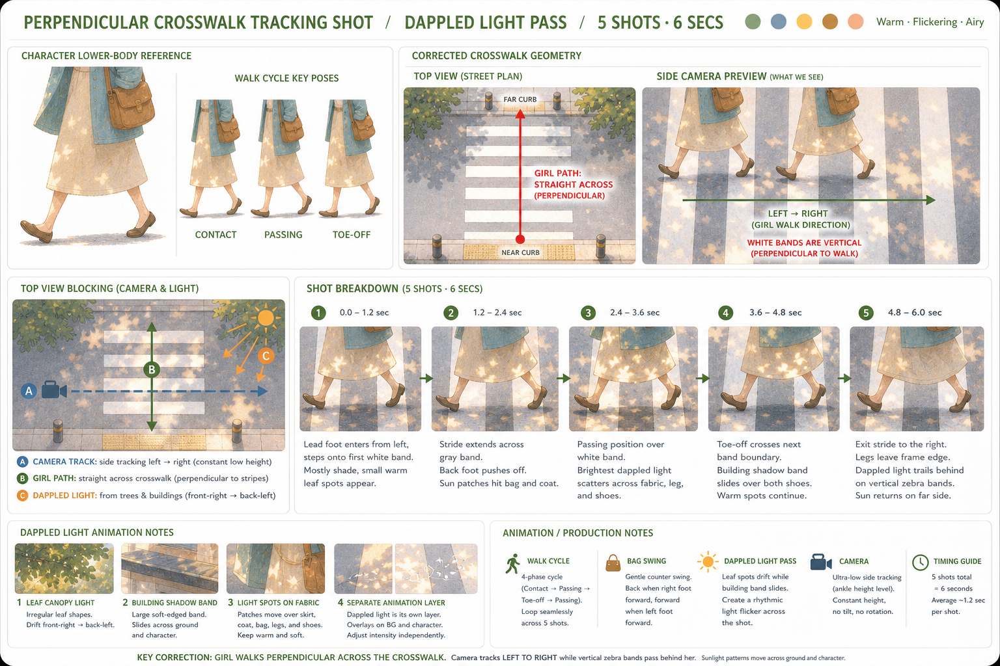
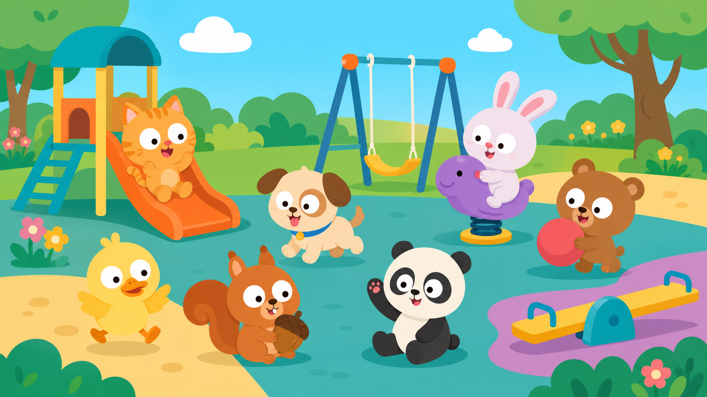
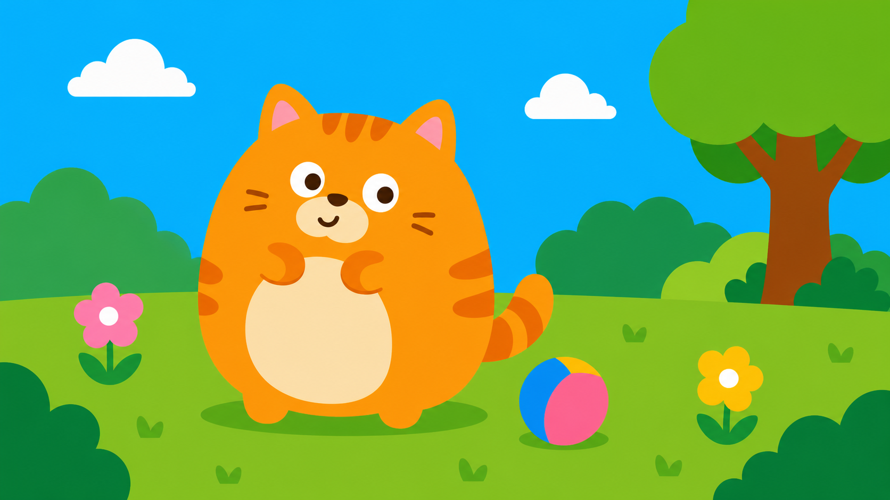
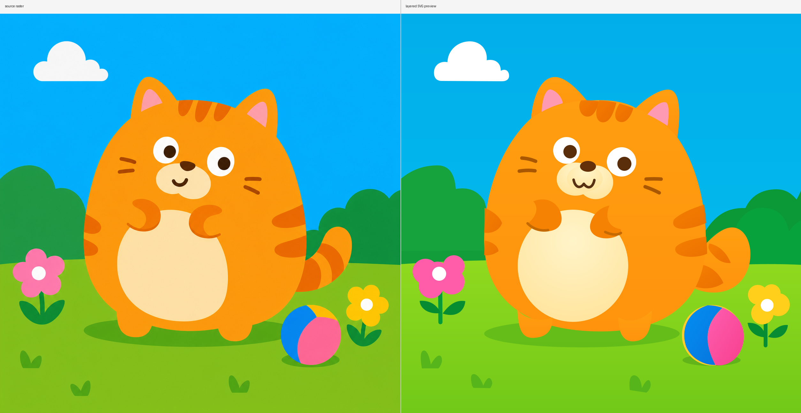

# KINE Skills

KINE Skills 是一组面向 Codex 环境的图像生成与动画生产辅助 SKILL 集合，专门为深度适配 image gen 工作流而设计。它们覆盖从儿童教育风格图片生成，到角色拆解、动画分镜规划、图片转 SVG 源母版等多个环节，适合作为 Kine 动画、互动课件、儿童游戏素材和角色生产流程的前置工具链。

## 注意

为了深度适配 image gen，所有 SKILL 都是完全基于 Codex 环境编写。

## 安装

将下面这段发送给你的 AI，即可让它按说明安装本仓库中的所有 SKILL：

```text
Fetch and follow instructions from https://raw.githubusercontent.com/verycafe/kine-skills/main/install.md
```

## SKILL 列表

### [kine-layer-v2-5](https://github.com/verycafe/kine-skills/tree/main/kine-layer-v2-5)

可以将用户提交的角色图片自动进行拆解，适合作为动画等工作的前序处理。


### [kine-summer-shot](https://github.com/verycafe/kine-skills/tree/main/kine-summer-shot)

可以生成动画分镜板。



### [kine-image-kids](https://github.com/verycafe/kine-skills/tree/main/kine-image-kids)

绘制儿童扁平风格图片。



### [kine-image-duolingo](https://github.com/verycafe/kine-skills/tree/main/kine-image-duolingo)

绘制多邻国风格图片。



### [kine-svg-dev](https://github.com/verycafe/kine-skills/tree/main/kine-svg-dev)

可以将图片转换成 SVG 格式。


