# Layer.ai and Scenario Research For Kine Pose Dev V3

Date: 2026-06-18

Purpose: capture public research used to improve Kine Pose Dev V3 Phase A action-frame generation and sequence QA.

## Executive Summary

Layer.ai and Scenario both point to the same useful Phase A lesson for Kine:

```text
good image-subject action/state-change frames need semantic part reasoning
not just pose prompts or local cutout manipulation
```

For V3, this means decomposition ideas should improve the motion contract, per-frame prompt/control plan, local repair strategy, and visual gates. They should not turn Phase A into source-master, component-ledger, or rig production.

The public Layer.ai and Scenario examples are mostly character-oriented. V3 uses them as evidence for semantic part reasoning, then generalizes the same idea to any source-image subject: character, product, prop, machine, vehicle, UI/icon, environment element, or effect.

## Layer.ai Findings

Primary public pages:

- `https://www.layer.ai/tools/layer--create-spine-components`
- `https://www.layer.ai/models/qwen--qwen-image-layered`
- `https://arxiv.org/html/2512.15603v1`
- `https://github.com/QwenLM/Qwen-Image-Layered`

Confirmed useful facts from public pages:

- Layer.ai exposes a tool named `AI Spine Component Generator` / `Create Spine Components`.
- The tool is positioned for Spine-style 2D component creation from a character reference.
- Public wording emphasizes independent animated components such as head, body, limbs, torso, clothes, and accessories.
- The tool promises clean edges, proportion preservation, overlap-friendly pieces, and animation usability.
- The tool does not replace manual rigging, and front-facing characters with clear limb separation work best.
- Layer.ai also exposes `Qwen-Image Layered`, which generates multiple distinct RGBA layers for editing or animation.
- The Qwen-Image-Layered research direction decomposes a single RGB image into semantic RGBA layers using learned layer decomposition rather than only classical segmentation.
- The Qwen-Image-Layered repository notes that prompts describe overall image content, not precise per-layer semantic control.

Inference for Kine Phase A:

- Layer.ai's product target proves that clean animation needs semantic part awareness and overlap reasoning.
- For Phase A, use that awareness before and after whole-subject generation: plan owners, occlusions, contacts, pivots, state changes, and forbidden failures per frame.
- Qwen-Image-Layered can be a reference or candidate aid for understanding layers, but its output is not a selected action frame.
- A good-looking frame should fail V3 if it hides broken owner relationships, impossible overlaps, holes, or detached children.

## Scenario Findings

Primary public pages:

- `https://www.scenario.com/apps/2d-animation-rigging-sheet`
- `https://www.scenario.com/apps/split-an-image-into-components`
- `https://docs.scenario.com/`

Confirmed useful facts from public pages:

- Scenario has a `2D Animation Rigging Sheet` app that generates a rigging parts sheet from a character concept/reference.
- The rigging sheet app is aimed at 2D animation tools such as Spine, Live2D, and Moho.
- The app output is best understood as a generated parts-sheet reference, not necessarily precise source-image segmentation.
- Scenario's `Split an Image Into Components` workflow is closer to a concrete decomposition pipeline.
- Public workflow copy describes listing components, segmenting each component, reconstructing cropped/hidden content, and removing backgrounds.
- The visible model stack on the public app page includes an LLM stage, SAM-style image segmentation, image generation/editing, and background removal.

Inference for Kine Phase A:

- Scenario gives a reusable thinking pattern:

```text
component list -> component mask -> hidden/cropped content reasoning -> background/edge cleanup -> QA
```

- In V3 Phase A, this pattern should become:

```text
owner list -> per-frame occlusion/contact/state plan -> whole-subject generation -> local repair candidate -> visual QA
```

- The rigging-sheet app is useful as a hidden-motion and overlap reference, but not as a selected-frame source.
- The component-splitting workflow is useful for diagnosing why a whole-subject candidate is broken and where masked repair should focus.

## Shared Pattern For Phase A

Both products imply this Phase A planning loop:

```mermaid
flowchart LR
  A["Source image / subject"] --> B["Semantic owner list"]
  B --> C["Per-frame moving and stable owners"]
  C --> D["Occlusion, overlap, contact, and prop-risk plan"]
  D --> E["Soft controls and prompt constraints"]
  E --> F["Whole-subject candidate frame"]
  F --> G["Local repair candidate when needed"]
  G --> H["Visual gate and sequence QA"]
  H --> I["Selected frame / board / GIF / strip"]
```



## Kine-Specific Takeaways

1. Add a hard distinction between `component_reasoning_reference` and `selected_whole_subject_frame`.
2. Require a semantic owner map before generating difficult action frames.
3. Require per-frame occlusion and overlap expectations for joints, crossing limbs, props, and contacts.
4. Use local masks or layered references to repair whole-subject candidates, not to create accepted component packages.
5. Require visual QA for holes, detached children, draw-order-looking failures, bad contact, and source-pose snapback.
6. Keep all decomposed or layered outputs as planning/review evidence until a whole-subject frame passes selection.

## Known Limits

- Public pages do not disclose Layer.ai or Scenario internal algorithms.
- Product examples are evidence of workflow behavior, not proof of exact model architecture.
- Generated rigging sheets can change character identity or details; they are useful references but not selected-frame evidence.
- RGBA layer models may produce semantic layers that are not stable Kine owners.
- Visual pass/fail for action plausibility still needs independent review; a deterministic script can check records and evidence, not artistic truth.
